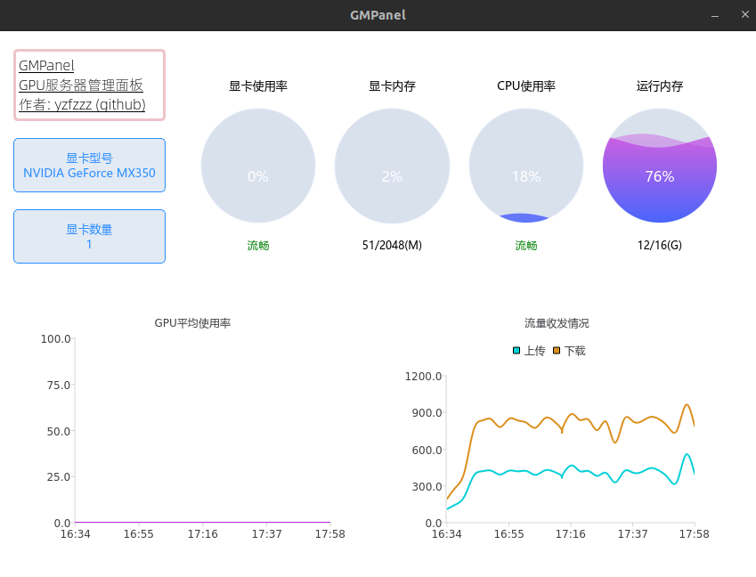

# GMPanel：GPU服务器管理面板

## 🎉项目意义

课题组是做深度学习的，现有3台服务器10几张显卡，但由于管理不善，经常意外关机等。因此，需要一套监控系统，同时监控多台服务器的cpu/gpu信息，帮助定位问题，减少宕机


## ⚙功能

- [x] 客户端GUI界面
- [x] 支持监控cpu、存储、gpu、网络等信息
- [x] 支持同时监控多台服务器
- [x] 支持日志记载运行记录
- [x] mysql数据库保存历史数据
- [x] 客户端界面美化
- [ ] 用户登陆/注册功能
- [ ] 同一用户多台主机同时监测
- [ ] 客户端跨平台移植，适配windows平台
- [ ] 服务端压力测试，监控端显卡压力测试
- [ ] 客户端打包exe文件(win)/bin文件(linux)，发布reslease版本

.......


## ✨特色

1. 采用SOA架构，监控端、服务端、客户端代码分离
2. 采用自制的 [mprpc](https://github.com/yzfzzz/mprpc) 微服务架构，不依赖第三方rpc框架（如grpc、brpc等）
3. docker一键部署，免去复杂的环境配置
4. 支持同时监控GPU服务器集群
5. 安全，不暴露本地端口
6. 支持历史数据云备份


## 🗂文件

| 文件名                                                       | 说明              |
| ------------------------------------------------------------ | ----------------- |
| [bin](https://github.com/yzfzzz/linux-monitor/tree/main/bin) | 可执行文件        |
| [database](https://github.com/yzfzzz/linux-monitor/tree/main/database) | mysql数据库连接池  |
| [display_monitor](https://github.com/yzfzzz/linux-monitor/tree/main/display_monitor) | 客户端            |
| [docker](https://github.com/yzfzzz/linux-monitor/tree/main/docker) | 环境配置          |
| [mprpc](https://github.com/yzfzzz/linux-monitor/tree/main/mprpc) | 自制的rpc框架     |
| [proto](https://github.com/yzfzzz/linux-monitor/tree/main/proto) | 数据传输格式      |
| [rpc_manager](https://github.com/yzfzzz/linux-monitor/tree/main/rpc_manager) | rpc客户端、服务端 |
| [test](https://github.com/yzfzzz/linux-monitor/tree/main/test) | 功能开发测试      |
| [test_monitor](https://github.com/yzfzzz/linux-monitor/tree/main/test_monitor) | 监控端            |
| [tool](https://github.com/yzfzzz/linux-monitor/tree/main/tool) | 第三方/自己实现的功能库  |

## 😍效果
### qt客户端界面


## 怎么用？

❌**待完善......**

先配置好docker环境，生成镜像，镜像名应为 linux:mprpc_monitor

然后：

```shell
./docker/scripts/monitor_docker_run.sh
./docker/scripts/monitor_docker_into.sh
cd ./home/work
./docker/build/install/start.sh
```

一键配置环境👆

然后，运行服务端和监控端

```shell
cd bin
./server -i address.conf & ./run.sh 
```

最后，在终端运行客户端（需要图形化界面）

```shell
./display -i address.conf
```
